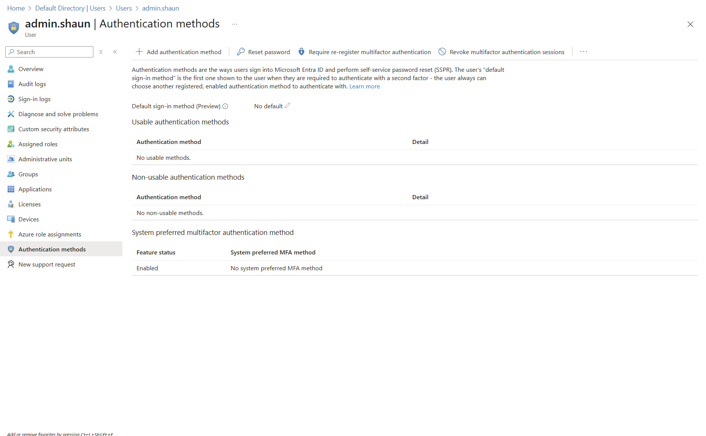

# Securing Entra ID: Fixing 5 IAM Misconfigurations in My Azure Lab  
### By Shaun Carrillo

---

## Overview

In this project, I built a sandbox Microsoft Entra ID (formerly Azure Active Directory) environment and intentionally misconfigured it to reflect real-world IAM security risks. I then audited the environment, identified 5 critical issues, and applied best-practice remediations.

---

## Lab Environment Setup

- **Platform**: [https://entra.microsoft.com](https://entra.microsoft.com)
- **Tenant**: Azure Free Tier

### Users Created:
- **admin.shaun** – Global Admin  
- **intern.kevin** – Intern  
- **hr.jane** – HR Generalist
- **sales.kyle** – Sales Representative
- **sec.auditor** – Security Auditor  
- **contractor.bob** – External/Orphaned account  

---

##  Misconfiguration #1: Intern With Global Admin Access

**Description**  
intern.kevin was assigned the **Global Administrator** role, the highest privilege role in Entra ID.

**Why This Is a Problem**  
Interns should never have unrestricted access to identity, application, and policy configuration. This violates least privilege and creates a massive risk vector.

**Remediation**
- Removed Global Admin role  
- Assigned no role (default user permissions only)  
- Documented justification for role changes  

**Screenshots**  

---

## Misconfiguration #2: HR Staff Assigned App Administrator Role

**Description**  
`hr.jane` was given the **Application Administrator** role, allowing her to register, manage, and delete enterprise apps.

**Why This Is a Problem**  
This enables an HR user to install or misconfigure OAuth-integrated apps or expose sensitive APIs without security oversight.

**Remediation**
- Removed Application Admin role  
- Scoped app access only through group-based permissions  
- Created a custom group policy to limit HR access  

**Screenshot**  

---

## Misconfiguration #3: No MFA Configured for Global Admin

**Description**  
`admin.shaun` had no multifactor authentication (MFA) methods enabled, and no Conditional Access enforcing MFA.

**Why This Is a Problem**  
A privileged account with no MFA is a top-tier risk for credential theft and lateral movement.

**Remediation**
- Enabled Authenticator App on `admin.shaun`  
- Created Conditional Access policy: “Enforce MFA for Directory Roles”  
- Verified policy impact on login flow  

**Screenshot**  

---

## ⚠️ Misconfiguration #4: Overprivileged User Roles Across Department

**Description**  
Users across multiple departments were granted broad roles:

- `hr.jane` → Application Admin (Misconfig #2)  
- `sales.kyle` → User Admin  

**Why This Is a Problem**  
Unscoped privileges introduce lateral attack potential if one user is compromised, the attacker gains high-value access to apps, users, or cloud policies.

**Remediation**
- Created custom RBAC roles using “least privilege” principles  
- Scoped permissions based on department functions  
- Documented role mapping strategy  

**Screenshot**  

---

## Misconfiguration #5: Orphaned Account with Security Role

**Description**  
`contractor.bob` was assigned the **Security Reader** role but was not assigned to any group, monitored project, or team.

**Why This Is a Problem**  
This is a classic case of access without ownership—a ghost account that could be hijacked or abused with no one noticing.

**Remediation**
- Flagged the account as orphaned  
- Disabled sign-in and issued access review  
- Created onboarding/offboarding checklist  

**Screenshot**  

---

## Audit & Remediation Summary

| Misconfiguration             | Risk Level | Resolution                  |
|-----------------------------|------------|-----------------------------|
| Intern w/ Global Admin      | Critical   | Role revoked                |
| HR with App Admin           | High       | Role removed, policy created|
| No MFA on Admin             | Critical   | MFA enforced via CA         |
| Overprivileged Users        | Medium     | Scoped roles applied        |
| Orphaned Contractor         | Medium     | Disabled + documented       |

---

## Final Thoughts

This project gave me real-world experience simulating identity-based risk, performing access audits, and applying security best practices in Entra ID. IAM is often overlooked in cloud security but it's where most breaches begin.

---

## Tools Used

- Microsoft Entra Portal  
- Azure Role Management  
- Conditional Access  
- Authentication Methods Console  

---

*Created with 💻 by Shaun Carrillo — [LinkedIn](https://linkedin.com/in/shaun-carrillo) | [GitHub](https://github.com/shaunc11)*
